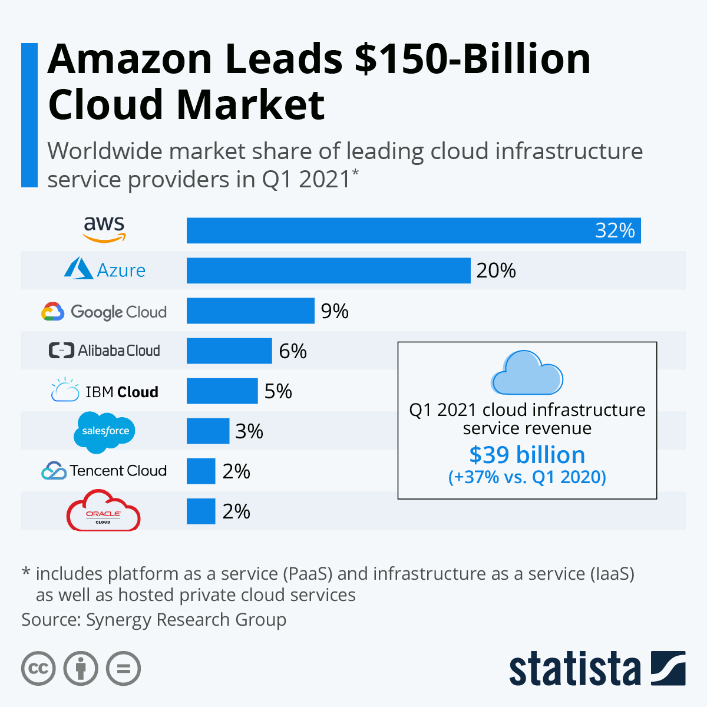

# Learning AWS

## Table of Contents

- [Introduction](#introduction)
- [A Brief History of AWS](#a-brief-history-of-aws)
- [Contribution and Issues](#contribution-and-issues)

## Introduction

Cloud Computing already is the future. Although it already has tech jobs totally related to Cloud (as Devops and SRE, for example), it is very important that developers know how to handle with all the new infrastructure to adapt yourselves to the inovations.

AWS (aka Amazon Web Services) is a Cloud Provider. Among the Cloud Computing context, big companies like Amazon, Microsoft and Google share the most part of the public usage (developers and other IT-related professions).

Holding the most part of the market share, the AWS platform exposes more than 100 services, with a lot of them serving to the same purpose, but generally with divergences in some operational mechanism (Serverless VS Virtual Machines VS Containers, for example) and in the pricing.

You don`t need to deeply know how to deal with each of these services, so this guide focus in the most important and essential services, as well as a vision more directioned to a Software Developer role.

Even though this repository explains the cloud environment based on the AWS, at the end everything is just a aggregation of services of a specific company, so all the cloud concepts are reusable to other Cloud Providers (just with other names, but still the exactly same idea).

## A Brief History of AWS

Amazon was one of the pioneers in the Cloud environment. It started back in 2003, when the leaders of the development team at Amazon detected a big strength of the company: its infrastructure had a great potential to serve more than only Amazon operations. In 2006, they have launched the core blocks of AWS in the time, consisting of Simple Storage Service (S3), Elastic Compute Cloud (EC2) and Simple Queue Service (SQS). 

Each year AWS service collection increases, as so its infrastructure related to the regions around the world, being specialized in delivering content with guaranteed scalability and disponibility. Today, AWS is used from small companies to the big techs like Netflix and Dropbox, making more than $110 billion of revenue to Amazon.

## Contribution and Issues

This project is open to suggestions and modifications, feel free to open [Issues](https://github.com/LuanSilveiraSouza/learning-aws/issues) and [Pull Requests](https://github.com/LuanSilveiraSouza/learning-aws/pulls)

Made with :heart: by Luan Souza.